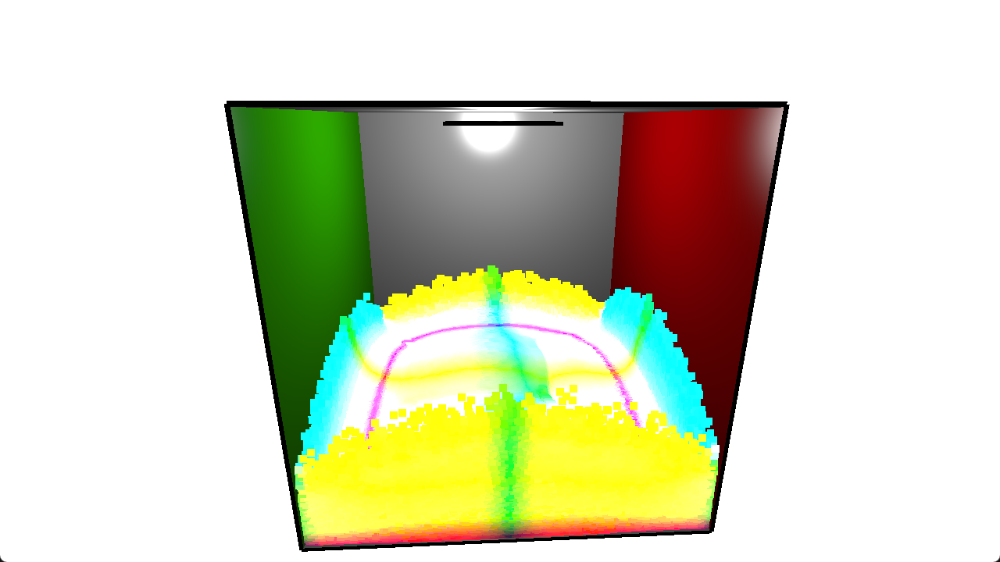
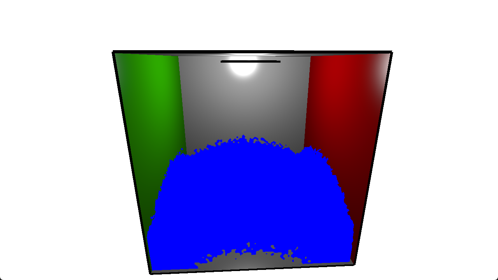
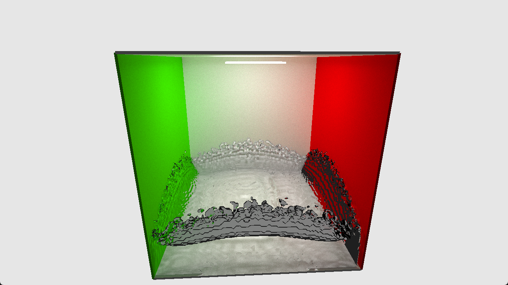

# CS-6610-Final-Project
Final project for CS6610 Interactive Computer Graphics at University of Utah.

[video](https://www.youtube.com/watch?v=KFb1aIS1WHs)\
## Reference
[https://github.com/nvpro-samples/nvpro_core](https://github.com/nvpro-samples/nvpro_core)\
[https://github.com/nvpro-samples/vk_raytracing_tutorial_KHR](https://github.com/nvpro-samples/vk_raytracing_tutorial_KHR)
